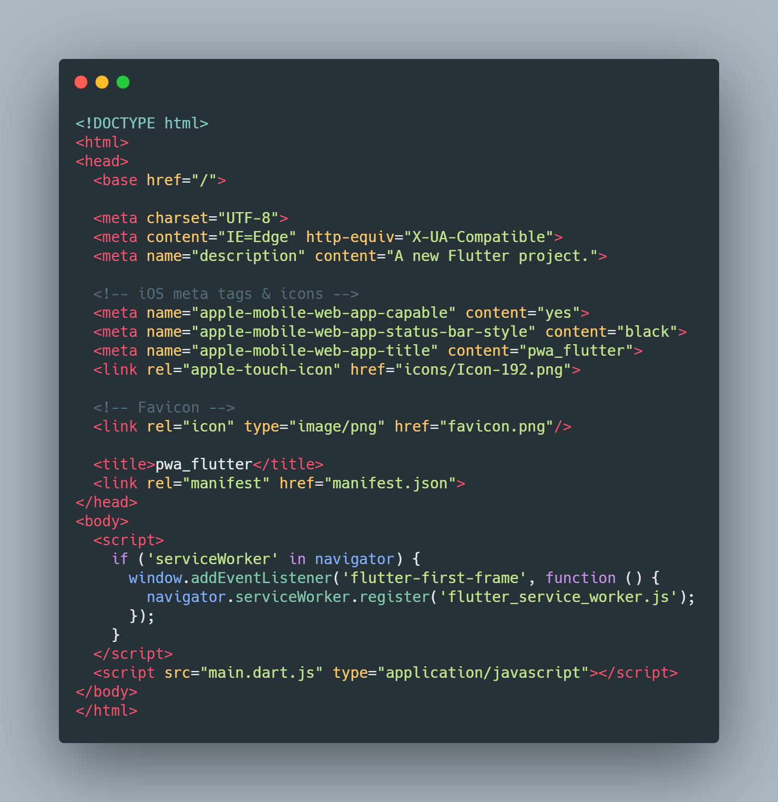
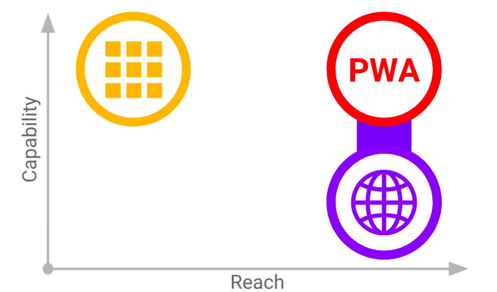

# Pwa Flutter 

​	Depuis la release 1.20, Flutter web inclut le support des PWA. Ces PWA sont installables et utilisable offline. Aucun changement par rapport à un PWA classique.

> https://flutter.dev/docs/deployment/web

## Comment les PWA sont intégrées à Flutter

​	Pour rendre notre site web installable, il faut nécessairement :

- Un manifeste, avec des champs obligatoires :	
  - `background_color` : la couleur du fond dans un contexte particulier comme le chargement de l'application.
  - `display` : spécifie comment l'application est affichée.
  - `icons` : l'icone représentant l'application dans le navigateur internet ou au chargement.
  - `name` ou un `shortname` : le premier est le nom complet et le second est utilisé lorsqu'il n'y a pas assez de place.
  - `start_url` : le lien vers le premier élément chargé lorsque l'application est installée.
- Un site web à servir depuis un domaine sécurisé HTTPS.
- Une icone représentant l'application. 
- Un *service worker* pour utiliser l'application en mode déconnecté.

##### Voici notre index.html

​	Il contient plusieurs paramètres utiles pour personnaliser l'application installé. Pour le rendre PWA sur les navigateurs supportés, le *serviceWorker* est activé entre les balise `<script>`. Ce service permet initialement de pouvoir configurer l'utilisation du cache de l'application pour une meilleure expérience en mode déconnecté. Flutter génère le `flutter_secure_worker.js` qui décrit l'utilisation du service, disponible dans :`.build/web/flutter_service_worker.js`

​	L'activation du PWA permet aux utilisateurs mobiles l'*Ajout à l'écran d'accueil* ou *A2HS*, une fonctionnalité des navigateurs utilisant les informations du manifeste pour proposer une version installable de l'application. Un écran accueil est parfois généré par certains navigateurs utilisant lui aussi les informations du manifeste.

###### Un point sur les contraintes d'IOS :

​	Les Progressives Web Apps permettent de bénéficier du meilleur des applications web et mobiles. Il permet de se rapprocher des capacités d'une application natives tout en ayant l'accessibilité d'un site web.

Malgré la compatibilité cross plateforme des PWA, Apple ajoute quelques contraintes à leur utilisation sur IOS. Il limite quelques utilisations :

- Pas d'incitation à installer l'icône sur l'écran d'accueil bien que cela soit possible.
- Pas de possibilité d'ouvrir un lien dans Safari depuis une PWA.
- Aucune notification push, pas d'authentification biométrique , etc.

## Hébergement avec Firebase

​	Pour tester un pwa, on peut utiliser Firebase, c'est un service proposé par Google permettant d'héberger notre application. 

Pour déployer notre application :

1. Il faut créer un compte sur le site du service (https://firebase.google.com/).
2. Créer le projet de notre application sur le site : https://console.firebase.google.com/
3. Installer Firebase grâce à Node.js et le *Node Package Manager*
4. `firebase login`
5. `firebase init`
6. Sélectionner `Hosting`
7. Sélectionner `Use an existing project` et le projet créé
8. Lui indiquer le chemin d'accès vers `build/web`
9. Lancer un *build* de notre appli web avec `flutter build web`
10. Finalement, lancer le déploiement grâce à `firebase deploy`

